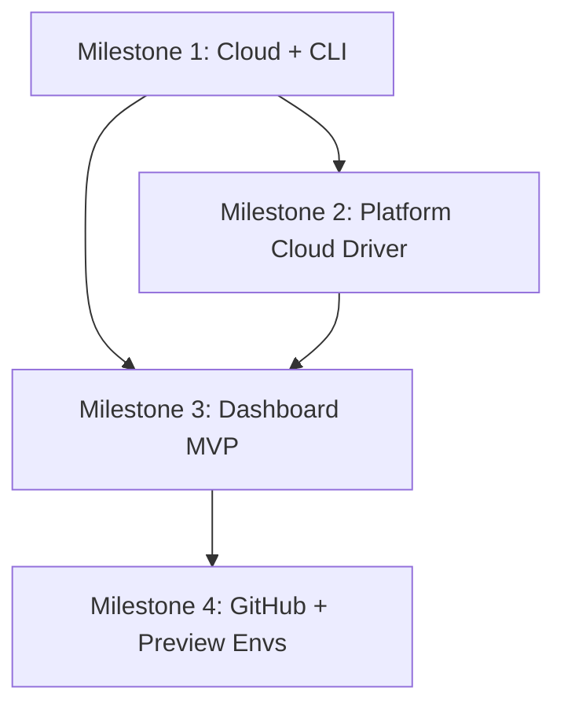

# CommerceJS Cloud — Implementation Plan

> **Goal**: Build a hosted commerce platform on Cloudflare that deploys CommerceJS stores from zero to production in minutes, with push-to-deploy, preview environments, and no GMV fees.

## Architecture Overview

```
┌──────────────────────────────────────────────────────────────┐
│                    CommerceJS Cloud                           │
│                                                              │
│  ┌───────────────────┐    ┌────────────────────────────────┐ │
│  │  Dashboard        │    │  Merchant Store (per tenant)   │ │
│  │  (Nuxt SSR)       │    │                                │ │
│  │  cloud.cjs.org    │    │  Cloudflare Pages → Storefront │ │
│  │                   │    │  Workers → API Routes (Nitro)  │ │
│  │  • Project CRUD   │    │  Neon Postgres → Product data  │ │
│  │  • Deploy trigger │    │  R2 → Product images/assets    │ │
│  │  • Env vars mgmt  │    │  KV → Cart sessions / cache    │ │
│  │  • Logs viewer    │    │                                │ │
│  │  • Billing (Stripe│    │  Platform Adapter (Prisma 7)   │ │
│  └───────────────────┘    └────────────────────────────────┘ │
│                                                              │
│  ┌──────────────────────────────────────────────────────────┐ │
│  │  @commercejs/cloud (Node.js library)                     │ │
│  │                                                          │ │
│  │  Cloudflare API → Workers, Pages, R2, KV, custom domains│ │
│  │  Neon API → Create DB, branch for previews, connection   │ │
│  │  GitHub API → Webhooks, repo access, PR detection        │ │
│  │  Stripe API / Tap API → Subscriptions, usage metering   │ │
│  └──────────────────────────────────────────────────────────┘ │
└──────────────────────────────────────────────────────────────┘
```

## User Review Required

> [!IMPORTANT]
> **Database Strategy**: SQLite (D1) for local dev, **Neon Postgres for production**. The Platform adapter already supports both via dual ORM (Drizzle + Prisma). Cloud will use Prisma 7 (pure TS, edge-ready, DB-agnostic) as the production ORM with `@prisma/adapter-neon`.

> [!IMPORTANT]
> **Scope Decision**: Phase 1 focuses on **`@commercejs/cloud`** (API orchestration library) and **`@commercejs/cli`** (`commercejs deploy`). The dashboard is Milestone 3. This lets us ship a working deploy flow before building UI.

> [!WARNING]
> **Cloudflare Account**: The Cloud Engine will need a Cloudflare API token with permissions for Workers, Pages, R2, KV, and D1. Users deploying stores will use *our* Cloudflare account (multi-tenant), not their own.

---

## Proposed Changes

### Milestone 1: Cloud + CLI ✅ (scaffold)

The core library that orchestrates Cloudflare + Neon APIs to deploy and manage stores.

---

#### [NEW] packages/cloud/

The infrastructure orchestration library. Pure Node.js, no UI.

##### [NEW] [package.json](file:///Users/baker/monorepos/commercejs/packages/cloud/package.json)
- Package: `@commercejs/cloud`
- Dependencies: `ofetch`, `consola`
- Peer: `wrangler` (for local dev only)

##### [NEW] [src/providers/cloudflare.ts](file:///Users/baker/monorepos/commercejs/packages/cloud/src/providers/cloudflare.ts)
- Wraps Cloudflare REST API (new beta API, Sept 2025)
- Methods: `createProject()`, `deployWorker()`, `createR2Bucket()`, `createKVNamespace()`, `setCustomDomain()`, `getDeploymentLogs()`
- Auth: Cloudflare API token

##### [NEW] [src/providers/neon.ts](file:///Users/baker/monorepos/commercejs/packages/cloud/src/providers/neon.ts)
- Wraps Neon REST API
- Methods: `createProject()`, `createBranch()`, `deleteBranch()`, `getConnectionString()`, `runMigrations()`
- Supports branch-per-PR for preview environments

##### [NEW] [src/providers/github.ts](file:///Users/baker/monorepos/commercejs/packages/cloud/src/providers/github.ts)
- GitHub App/OAuth integration
- Methods: `installWebhook()`, `getPushEvent()`, `cloneRepo()`, `getPRBranch()`
- Listens for push/PR events to trigger deploys

##### [NEW] [src/providers/billing.ts](file:///Users/baker/monorepos/commercejs/packages/cloud/src/providers/billing.ts)
- Dual billing provider: **Tap Payments** (GCC) + **Stripe** (international)
- Methods: `createSubscription()`, `recordUsage()`, `getInvoice()`, `createCheckoutSession()`
- Auto-selects provider based on merchant region/currency
- Future milestone (M4+)

##### [NEW] [src/deploy.ts](file:///Users/baker/monorepos/commercejs/packages/cloud/src/deploy.ts)
- Main deploy orchestrator: `deployStore(config)`
- Pipeline: Clone → Build → Migrate DB → Deploy Workers/Pages → Set domain → Health check
- Supports: `production`, `staging`, `preview` environments

##### [NEW] [src/types.ts](file:///Users/baker/monorepos/commercejs/packages/cloud/src/types.ts)
- Types: `CloudProject`, `CloudEnvironment`, `DeployConfig`, `DeployResult`, `CloudProvider`

##### [NEW] [src/index.ts](file:///Users/baker/monorepos/commercejs/packages/cloud/src/index.ts)
- Barrel exports

---

#### [NEW] packages/cli/

CLI tool: `commercejs deploy`, `commercejs init`, `commercejs env`.

##### [NEW] [package.json](file:///Users/baker/monorepos/commercejs/packages/cli/package.json)
- Package: `@commercejs/cli`, bin: `commercejs`
- Dependencies: `@commercejs/cloud`, `citty`, `consola`, `giget`

##### [NEW] [src/commands/deploy.ts](file:///Users/baker/monorepos/commercejs/packages/cli/src/commands/deploy.ts)
- `commercejs deploy` — pushes current project to Cloud
- Uses `@commercejs/cloud` `deployStore()` under the hood
- Flags: `--env production|staging|preview`, `--branch`

##### [NEW] [src/commands/init.ts](file:///Users/monorepos/commercejs/packages/cli/src/commands/init.ts)
- `commercejs init` — scaffolds a new CommerceJS project
- Prompts: adapter choice, DB preference, storefront template

##### [NEW] [src/commands/env.ts](file:///Users/baker/monorepos/commercejs/packages/cli/src/commands/env.ts)
- `commercejs env set KEY=VALUE` — manage env vars for a Cloud project
- `commercejs env pull` — download env vars to `.env`

---

### Milestone 2: Platform Adapter Cloud Driver ✅ (scaffold)

Make `@commercejs/platform` work natively on Cloudflare with Neon Postgres.

---

#### [MODIFY] [adapter.ts](file:///Users/baker/monorepos/commercejs/packages/platform/src/adapter.ts)
- Add `createPlatformAdapter({ driver: 'neon', connectionString: '...' })` option
- Driver auto-detection: `better-sqlite3` for local, `neon-http` for cloud

#### [NEW] [src/database/neon/](file:///Users/baker/monorepos/commercejs/packages/platform/src/database/neon/)
- New Prisma driver adapter using `@prisma/adapter-neon`
- `client.ts` — Neon-specific Prisma client initialization
- `migrate.ts` — Migration runner for Neon (via Prisma Migrate)
- Shares existing Prisma schema and query layer

#### [MODIFY] [package.json](file:///Users/baker/monorepos/commercejs/packages/platform/package.json)
- Add optional peer dep: `@neondatabase/serverless`, `@prisma/adapter-neon`

---

### Milestone 3: Cloud Dashboard MVP ✅ (scaffold)

Nuxt app at `cloud.commercejs.org` — the management UI.

---

#### [NEW] apps/dashboard/

Full Nuxt 4 application with Nuxt UI components.

##### Key pages:
- `/` — Landing page (marketing)
- `/login`, `/register` — Auth (GitHub OAuth or email/password)
- `/projects` — List all projects
- `/projects/[id]` — Project detail (deployments, env vars, logs, domains)
- `/projects/[id]/settings` — Project configuration
- `/projects/[id]/deployments/[deployId]` — Build logs, deploy status
- `/billing` — Subscription management (Stripe Customer Portal)

##### Key features:
- GitHub OAuth for login + repo access
- Real-time deployment logs via SSE/WebSocket
- Env vars editor with encrypted storage
- Custom domain management
- Usage metrics visualization

---

### Milestone 4: GitHub Integration + Preview Environments ✅ (scaffold)

---

#### [MODIFY] [src/providers/github.ts](file:///Users/baker/monorepos/commercejs/packages/cloud/src/providers/github.ts)
- GitHub App webhook handler: `push` → deploy production, `pull_request` → deploy preview
- PR comment bot: posts preview URL on each PR

#### [MODIFY] [src/providers/neon.ts](file:///Users/baker/monorepos/commercejs/packages/cloud/src/providers/neon.ts)  
- Branch-per-PR: create Neon branch on PR open, delete on PR merge/close
- `expires_at` support for auto-cleanup (max 30 days)

#### [MODIFY] [src/deploy.ts](file:///Users/baker/monorepos/commercejs/packages/cloud/src/deploy.ts)
- Preview deploy pipeline: branch DB → deploy to unique subdomain → comment on PR

---

## Dependency Map



| Milestone | Depends On | Estimated Effort |
|-----------|-----------|-----------------|
| **M1**: Cloud + CLI | Nothing (can start now) | 1-2 weeks |
| **M2**: Platform Cloud Driver | M1 (for deploy testing) | 3-5 days |
| **M3**: Dashboard MVP | M1 + M2 | 2-3 weeks |
| **M4**: GitHub + Previews | M3 | 1 week |

---

## Verification Plan

### Automated Tests
- `@commercejs/cloud`: Unit tests mocking Cloudflare/Neon APIs
- CLI: Integration tests for `init`, `deploy`, `env` commands
- Platform Neon Driver: Contract tests (reuse existing suite against Neon)
- Dashboard: Playwright E2E tests for core flows

### Manual Verification
- Deploy a real store via CLI → verify it's live on Cloudflare
- Create preview environment from PR → verify branched DB + unique URL
- Dashboard: create project → deploy → view logs → set custom domain
- Billing: subscribe → deploy → verify usage metering

### Smoke Test
```bash
# The "zero to production" path:
npx @commercejs/cli init my-store
cd my-store
commercejs deploy --env production
# → Store live at my-store.commercejs.cloud ✅
```
