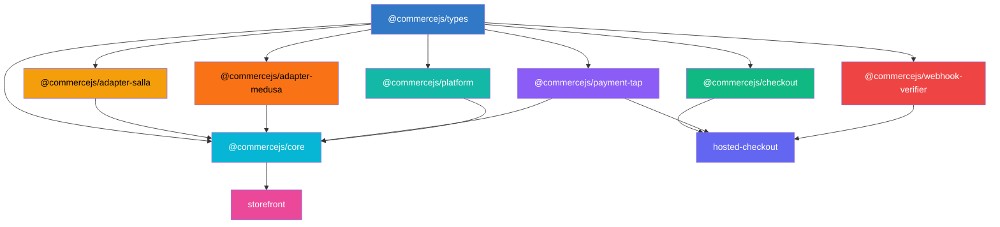

<p align="center">
  <h1 align="center">CommerceJS</h1>
  <p align="center">
    A modular, provider-agnostic eCommerce toolkit for JavaScript and TypeScript.
  </p>
</p>

<p align="center">
  <a href="https://github.com/commerce-js/commerce.js/actions/workflows/release.yml"></a>
  <a href="https://www.npmjs.com/org/commercejs"></a>
  <a href="https://www.typescriptlang.org/"></a>
  <a href="https://nuxt.com/"></a>
  <a href="https://turbo.build/"></a>
  <a href="https://pnpm.io/"></a>
  <a href="https://commerce.js.org"></a>
  <a href="LICENSE"></a>
</p>

---

## Overview

Every eCommerce platform speaks a different language — Salla, Shopify, WooCommerce each have their own APIs, data shapes, and payment flows. Switching platforms means rewriting everything.

**CommerceJS** solves this with three core ideas:

- **Unified types** — A single data model for products, carts, orders, and customers that works across every platform
- **Adapter pattern** — Each platform implements the `CommerceAdapter` interface, mapping its API to the unified types
- **Pluggable providers** — Payment providers implement the `PaymentProvider` interface, making them hot-swappable
- **Orchestration engine** — `createCommerce()` wires adapter + payments + event bus + webhooks into a single entry point

It works across any JavaScript runtime — Node.js, Edge, Deno, or the browser.

## Documentation

Visit the full documentation at **[commerce.js.org](https://commerce.js.org)**

## Packages

### Libraries (published to npm)

| Package | Version | Description |
|---------|---------|-------------|
| [`@commercejs/types`](packages/types) | [](https://www.npmjs.com/package/@commercejs/types) | Unified Data Model — 20+ domain types |
| [`@commercejs/core`](packages/core) | [](https://www.npmjs.com/package/@commercejs/core) | Orchestration engine — createCommerce(), event bus, webhooks |
| [`@commercejs/checkout`](packages/checkout) | [](https://www.npmjs.com/package/@commercejs/checkout) | Checkout state machine for payment flows |
| [`@commercejs/payment-tap`](packages/payment-tap) | [](https://www.npmjs.com/package/@commercejs/payment-tap) | Tap Payments provider — redirect-based, PCI-free |
| [`@commercejs/delivery-armada`](packages/delivery-armada) | [](https://www.npmjs.com/package/@commercejs/delivery-armada) | Armada last-mile delivery provider |
| [`@commercejs/delivery-parcel`](packages/delivery-parcel) | [](https://www.npmjs.com/package/@commercejs/delivery-parcel) | Parcel delivery provider — OAuth2, multi-region |
| [`@commercejs/webhook-verifier`](packages/webhook-verifier) | [](https://www.npmjs.com/package/@commercejs/webhook-verifier) | Cryptographic webhook signature verification |
| [`@commercejs/adapter-salla`](packages/adapter-salla) | [](https://www.npmjs.com/package/@commercejs/adapter-salla) | Salla platform adapter |
| [`@commercejs/adapter-medusa`](packages/adapter-medusa) | [](https://www.npmjs.com/package/@commercejs/adapter-medusa) | Medusa V2 platform adapter |
| [`@commercejs/platform`](packages/platform) | [](https://www.npmjs.com/package/@commercejs/platform) | Built-in commerce engine — SQLite-powered, zero-config |
| [`@commercejs/nuxt`](packages/nuxt) | [](https://www.npmjs.com/package/@commercejs/nuxt) | Nuxt module — composables, plugin, and auto-generated REST API |
| [`@commercejs/ui`](packages/ui) | [](https://www.npmjs.com/package/@commercejs/ui) | 30+ eCommerce UI components built on Nuxt UI |
| [`@commercejs/notification-resend`](packages/notification-resend) | [](https://www.npmjs.com/package/@commercejs/notification-resend) | Resend email notification provider |
| [`@commercejs/notification-smtp`](packages/notification-smtp) | [](https://www.npmjs.com/package/@commercejs/notification-smtp) | SMTP email notification provider |
| [`@commercejs/analytics-ga`](packages/analytics-ga) | [](https://www.npmjs.com/package/@commercejs/analytics-ga) | Google Analytics 4 provider |
| [`@commercejs/cloud`](packages/cloud) | [](https://www.npmjs.com/package/@commercejs/cloud) | Cloud infrastructure orchestration |
| [`@commercejs/cli`](packages/cli) | [](https://www.npmjs.com/package/@commercejs/cli) | CLI tool — deploy, init, env |

### Applications (private)

| App | Description |
|-----|-------------|
| [`hosted-checkout`](apps/hosted-checkout) | Deployable checkout app with embedded Tap card elements |
| [`storefront`](apps/storefront) | Reference storefront built with Nuxt |
| [`docs`](apps/docs) | Documentation site — [commerce.js.org](https://commerce.js.org) |
| [`dashboard`](apps/dashboard) | Cloud dashboard — [commercejs.cloud](https://commercejs.cloud) |

## Architecture



All packages depend on `@commercejs/types` as the shared language. The `@commercejs/core` engine orchestrates adapters, payment providers, and events. The checkout engine accepts any `PaymentProvider` implementation.

## Getting Started

### Prerequisites

- [Node.js](https://nodejs.org/) v22+
- [pnpm](https://pnpm.io/) v9+

### Setup

```bash
# Clone the repository
git clone https://github.com/commerce-js/commerce.js.git
cd commerce.js

# Install dependencies
pnpm install

# Build all packages
pnpm turbo run build
```

### Development

```bash
# Run the docs site locally
cd apps/docs && pnpm dev

# Run the storefront locally
cd apps/storefront && pnpm dev

# Run tests
pnpm turbo run test

# Type check
pnpm turbo run typecheck
```

## Quick Start

### Using the orchestration engine

```typescript
import { createCommerce } from '@commercejs/core'
import { SallaAdapter } from '@commercejs/adapter-salla'
import { TapPaymentProvider } from '@commercejs/payment-tap'

const commerce = createCommerce({
  adapter: new SallaAdapter({ token: process.env.SALLA_TOKEN! }),
  payments: {
    tap: new TapPaymentProvider({
      secretKey: process.env.TAP_SECRET_KEY!,
      publishableKey: process.env.TAP_PUBLISHABLE_KEY!,
    }),
  },
  defaultPayment: 'tap',
})

// Capability-checked calls
const products = await commerce.getProducts({ query: 'shirt' })
const cart = await commerce.createCart()

// Event-driven side effects
commerce.events.on('order.created', ({ order }) => {
  console.log('New order:', order.id)
})

// Multi-provider payments
const session = await commerce.createPayment({
  amount: 99.99,
  currency: 'SAR',
})
```

### Using the checkout engine

```typescript
import { CheckoutSession } from '@commercejs/checkout'
import { TapPaymentProvider } from '@commercejs/payment-tap'

const provider = new TapPaymentProvider({
  secretKey: process.env.TAP_SECRET_KEY!,
  publishableKey: process.env.TAP_PUBLISHABLE_KEY!,
})

const session = new CheckoutSession({ provider })

session.on('complete', ({ session }) => {
  console.log('Payment complete:', session.id)
})

await session.initialize({
  amount: 100,
  currency: 'SAR',
  customer: { email: 'customer@example.com' },
})
```

### Using the Salla adapter

```typescript
import { SallaAdapter } from '@commercejs/adapter-salla'

const adapter = new SallaAdapter({
  accessToken: process.env.SALLA_TOKEN!,
})

const products = await adapter.getProducts({ limit: 10 })
const cart = await adapter.getCart(cartId)
```

### Using the Medusa adapter

```typescript
import { MedusaAdapter } from '@commercejs/adapter-medusa'

const adapter = new MedusaAdapter({
  baseUrl: 'http://localhost:9000',
  publishableApiKey: process.env.MEDUSA_KEY!,
})

const products = await adapter.getProducts({ query: 'shirt' })
const cart = await adapter.createCart()
await adapter.addToCart(cart.id, { productId: 'prod_01', variantId: 'var_01', quantity: 1 })
```

### Using the built-in platform engine

```typescript
import { initDatabase, createPlatformAdapter } from '@commercejs/platform'

// Initialize SQLite database (auto-creates tables)
initDatabase({ driver: 'drizzle' })

const adapter = createPlatformAdapter({ currency: 'SAR' })

// Full commerce operations, zero external APIs
const products = await adapter.getProducts({ limit: 10 })
const cart = await adapter.createCart()
const brands = await adapter.getBrands()
const summary = await adapter.getReviewSummary('prod-1')
```

### Verifying webhooks

```typescript
import { verifyWebhook } from '@commercejs/webhook-verifier'

const isValid = verifyWebhook({
  provider: 'tap',
  payload: request.body,
  secret: process.env.WEBHOOK_SECRET!,
  signature: request.headers['x-tap-signature'],
})
```

## Repository Structure

```
commerce.js/
├── packages/
│   ├── types/               # Unified data model types
│   ├── core/                # Orchestration engine
│   ├── checkout/            # Checkout state machine
│   ├── payment-tap/         # Tap Payments provider
│   ├── delivery-armada/     # Armada delivery provider
│   ├── delivery-parcel/     # Parcel delivery provider
│   ├── webhook-verifier/    # Webhook signature verification
│   ├── adapter-salla/       # Salla platform adapter
│   ├── adapter-medusa/      # Medusa V2 platform adapter
│   ├── platform/            # Built-in commerce engine (SQLite)
│   ├── nuxt/                # Nuxt module
│   ├── ui/                  # eCommerce UI components
│   ├── notification-resend/ # Resend email provider
│   ├── analytics-ga/        # Google Analytics 4 provider
│   ├── hosted-checkout/     # Deployable checkout app
│   ├── storefront/          # Reference storefront
│   └── docs/                # Documentation site
├── .github/workflows/       # CI/CD pipelines
├── .changeset/              # Version management
├── turbo.json               # Turborepo task config
└── pnpm-workspace.yaml      # Workspace definition
```

## Contributing

Contributions are welcome! This project uses [Changesets](https://github.com/changesets/changesets) for versioning.

```bash
# Create a changeset after making changes
pnpm release

# Follow the prompts to select packages and describe your change
# Commit the generated changeset file with your PR
```

When your PR is merged to `main`, the release workflow automatically creates a version PR. Merging that PR publishes updated packages to npm.

## Reporting Issues

Found a bug or have a suggestion? [Open an issue](https://github.com/commerce-js/commerce.js/issues).

Please include:
- Description of the problem
- Steps to reproduce
- Expected vs actual behavior
- Package name and version

## Acknowledgements

Built with these excellent open source projects:

- **[Nuxt](https://nuxt.com/)** — Full-stack Vue framework
- **[Turborepo](https://turbo.build/)** — High-performance monorepo build system
- **[Changesets](https://github.com/changesets/changesets)** — Version management for monorepos
- **[Vitest](https://vitest.dev/)** — Blazing fast unit testing
- **[TypeScript](https://www.typescriptlang.org/)** — Type-safe JavaScript
- **[pnpm](https://pnpm.io/)** — Fast, disk-efficient package manager

## License

This project is licensed under the [MIT License](LICENSE).

Core packages (`@commercejs/types`, `@commercejs/checkout`, `@commercejs/nuxt`, etc.) are MIT-licensed and free to use in any project. Premium adapters may use a separate commercial license — check individual package `LICENSE` files for details.
