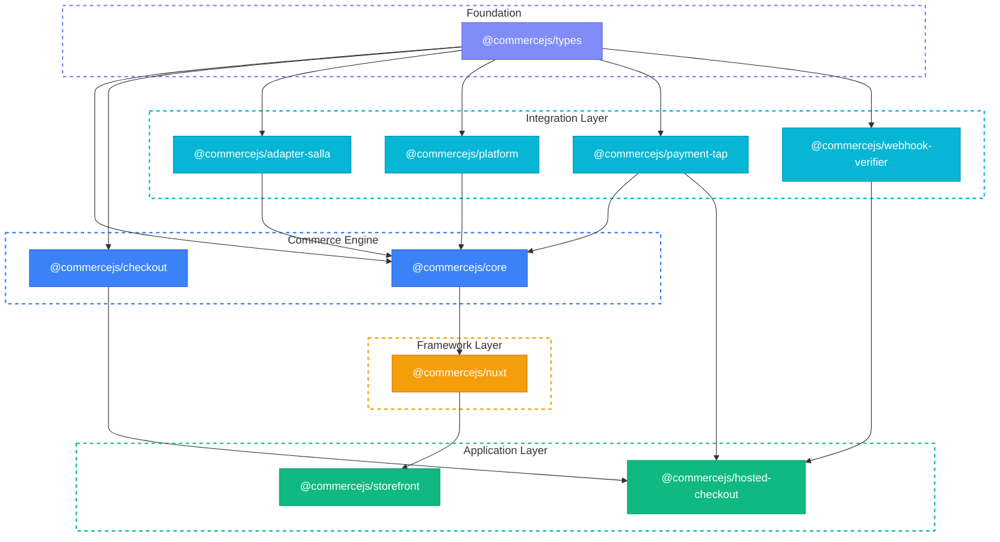

CommerceJS is organized as a layered architecture where each package has a single responsibility. The packages compose together through well-defined interfaces.

## Package Dependency Graph



All packages depend on `@commercejs/types` as the shared language. The `@commercejs/core` engine orchestrates adapters, payment providers, and events into a single entry point. The `@commercejs/nuxt` module wraps the engine for Nuxt applications, and the checkout engine handles the payment flow.

## Design Principles

### Adapter Pattern

The `CommerceAdapter` interface defines how storefronts talk to eCommerce backends. Each platform (Salla, Shopify, WooCommerce) provides an adapter that maps its API to the unified types. The built-in `@commercejs/platform` adapter provides a zero-config SQLite engine for development and embedded commerce.

```ts
// The adapter contract
interface CommerceAdapter {
  readonly name: string
  readonly capabilities: AdapterDomain[]
  // CatalogAdapter — products, categories, brands
  // CartAdapter — cart operations
  // CheckoutAdapter — shipping, payment, order placement
  // CustomerAdapter — auth, profile, address book
  // OrderAdapter — order CRUD, status
  // ... 16+ domain interfaces
}
```

The `createCommerce()` engine wraps the adapter with capability routing, events, and multi-provider payments:

```ts
import { createCommerce } from '@commercejs/core'
import { SallaAdapter } from '@commercejs/adapter-salla'
import { TapPaymentProvider } from '@commercejs/payment-tap'

const commerce = createCommerce({
  adapter: new SallaAdapter({ token: '...' }),
  payments: { tap: new TapPaymentProvider({ secretKey: '...' }) },
  defaultPayment: 'tap',
})

const products = await commerce.getProducts({ query: 'shirt' })
// Returns SearchResult — same shape for Salla, Shopify, or any other platform
```

### Provider Interface

Payment providers implement the `PaymentProvider` interface. The checkout engine does not know or care which provider it uses:

```ts
interface PaymentProvider {
  createSession(input: CreatePaymentSessionInput): Promise<PaymentSession>
  confirmSession(sessionId: string): Promise<PaymentSession>
  refund(input: RefundInput): Promise<PaymentSession>
  verifyWebhook(event: PaymentWebhookEvent): Promise<boolean>
}
```

Swapping from Tap to Stripe requires changing one line — the provider instantiation.

### State Machine

The `CheckoutSession` uses a finite state machine to enforce valid checkout flows. Each state has defined transitions, and invalid transitions throw errors:

| State | Allowed Transitions | Triggered By |
|---|---|---|
| `idle` | `info` | `setCustomerInfo()` |
| `info` | `shipping` | `setShippingAddress()` |
| `shipping` | `payment` | `submitPayment()` |
| `payment` | `confirming`, `complete`, `failed` | `confirmPayment()`, webhook |
| `confirming` | `complete`, `failed` | Provider response |
| `failed` | `payment` | Retry |
| `complete` | — | Terminal |

## Layer Responsibilities

| Layer | Packages | Role |
|---|---|---|
| **Types** | `@commercejs/types` | Shared vocabulary — interfaces only, no runtime code |
| **Orchestration** | `@commercejs/core` | Engine — `createCommerce()`, event bus, capability routing, webhook dispatch |
| **Checkout** | `@commercejs/checkout` | State machine — manages the checkout flow lifecycle |
| **Providers** | `@commercejs/payment-tap` | Gateway integration — API calls, request mapping |
| **Infrastructure** | `@commercejs/webhook-verifier` | Cross-cutting — security, verification |
| **Adapters** | `@commercejs/adapter-salla`, `@commercejs/platform` | Platform glue — maps external or built-in APIs to unified types |
| **Framework** | `@commercejs/nuxt` | Nuxt module — composables, server routes, runtime plugin |
| **Applications** | `hosted-checkout`, `storefront` | End-user apps — Nuxt applications |

