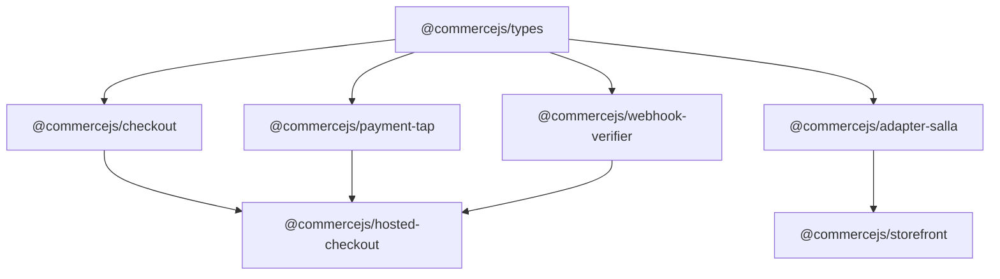

CommerceJS is organized as a layered architecture where each package has a single responsibility. The packages compose together through well-defined interfaces.

## Package Dependency Graph



All packages depend on `@commercejs/types` as the shared language. The checkout engine depends on the type system and accepts any `PaymentProvider`. The hosted checkout application ties everything together.

## Design Principles

### Adapter Pattern

The `CommerceAdapter` interface defines how storefronts talk to eCommerce backends. Each platform (Salla, Shopify, WooCommerce) provides an adapter that maps its API to the unified types.

```ts
// The adapter contract
interface CommerceAdapter {
  catalog: CatalogAdapter    // Products, categories, brands
  cart: CartAdapter           // Cart operations
  checkout: CheckoutAdapter   // Checkout flow
  customer: CustomerAdapter   // Customer management
  order: OrderAdapter         // Order history, status
  // ... more domains
}
```

A storefront imports the adapter for its platform and calls the same API regardless of the backend:

```ts [storefront/server/api/products.ts]
import { createSallaAdapter } from '@commercejs/adapter-salla'

const adapter = createSallaAdapter({ token, baseUrl })
const products = await adapter.catalog.getProducts({ limit: 10 })
// Returns Product[] — same shape for Salla, Shopify, or any other platform
```

### Provider Interface

Payment providers implement the `PaymentProvider` interface. The checkout engine does not know or care which provider it uses:

```ts
interface PaymentProvider {
  createSession(input: CreatePaymentSessionInput): Promise<PaymentSession>
  confirmSession(sessionId: string): Promise<PaymentSession>
  refund(input: RefundInput): Promise<PaymentSession>
  verifyWebhook(event: PaymentWebhookEvent): Promise<boolean>
}
```

Swapping from Tap to Stripe requires changing one line — the provider instantiation.

### State Machine

The `CheckoutSession` uses a finite state machine to enforce valid checkout flows. Each state has defined transitions, and invalid transitions throw errors:

| State | Allowed Transitions | Triggered By |
|---|---|---|
| `idle` | `info` | `setCustomerInfo()` |
| `info` | `shipping` | `setShippingAddress()` |
| `shipping` | `payment` | `submitPayment()` |
| `payment` | `confirming`, `complete`, `failed` | `confirmPayment()`, webhook |
| `confirming` | `complete`, `failed` | Provider response |
| `failed` | `payment` | Retry |
| `complete` | — | Terminal |

## Layer Responsibilities

| Layer | Packages | Role |
|---|---|---|
| **Types** | `@commercejs/types` | Shared vocabulary — interfaces only, no runtime code |
| **Engine** | `@commercejs/checkout` | Business logic — state machine, event emitter |
| **Providers** | `@commercejs/payment-tap` | Gateway integration — API calls, request mapping |
| **Infrastructure** | `@commercejs/webhook-verifier` | Cross-cutting — security, verification |
| **Adapters** | `@commercejs/adapter-salla` | Platform glue — maps external APIs to unified types |
| **Applications** | `hosted-checkout`, `storefront` | End-user apps — Nuxt applications |
