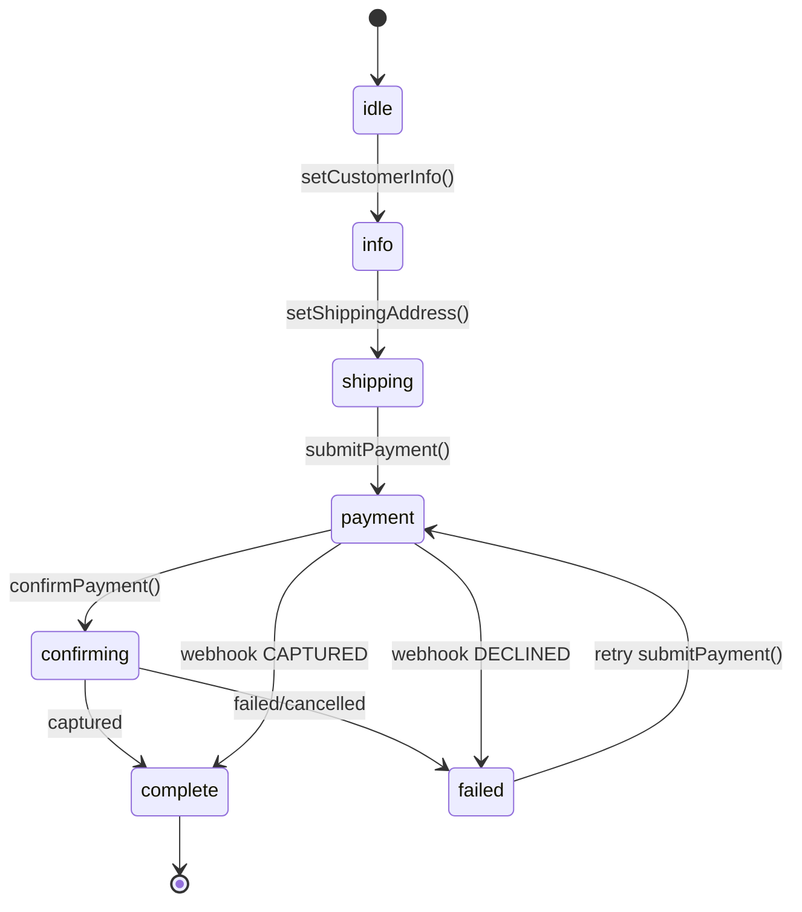

# Checkout Flow

> How the CheckoutSession state machine manages the payment lifecycle from start to finish.

The `CheckoutSession` class is a framework-agnostic state machine that orchestrates the complete checkout flow. It enforces valid transitions, emits events, and works identically in Node.js, Edge runtimes, and the browser.

## State Machine



## Step-by-Step Flow

<steps>

### Customer Info (idle → info)

The session starts in `idle` state. Calling `setCustomerInfo()` validates the customer data and transitions to `info`:

```ts
session.setCustomerInfo({
  email: 'customer@example.com',
  firstName: 'Ahmed',
  lastName: 'Al-Rashid',
  phone: '+97312345678',
})
// session.state === 'info'
```

### Shipping Address (info → shipping)

Providing a shipping address moves the session to `shipping`. You can optionally set a separate billing address:

```ts
session.setShippingAddress(shippingAddress, billingAddress)
// session.state === 'shipping'
```

### Payment Submission (shipping → payment)

Calling `submitPayment()` creates a payment session with the provider. The session transitions to `payment` while awaiting the result:

```ts
const paymentSession = await session.submitPayment({
  sourceToken: 'tok_xxx',
})
// session.state === 'payment'
// paymentSession.redirectUrl → 3DS URL (if required)
```

### Payment Confirmation (payment → confirming → complete)

After 3DS redirect, confirm the payment to finalize:

```ts
const confirmed = await session.confirmPayment(chargeId)
// session.state === 'complete' (if captured)
// session.state === 'failed' (if declined)
```

### Webhook Safety Net (payment → complete)

For asynchronous results, the `handleWebhookUpdate()` method can transition the session directly from any non-terminal state:

```ts
session.handleWebhookUpdate(paymentSession)
// Forces to 'complete' or 'failed' based on status
```

</steps>

## Sync-on-Return vs Webhook

CommerceJS uses a dual strategy for payment confirmation:

<table>
<thead>
  <tr>
    <th>
      Method
    </th>
    
    <th>
      When
    </th>
    
    <th>
      How
    </th>
  </tr>
</thead>

<tbody>
  <tr>
    <td>
      <strong>
        Sync-on-Return
      </strong>
    </td>
    
    <td>
      Customer redirected back
    </td>
    
    <td>
      <code>
        confirmPayment()
      </code>
      
       calls provider to verify
    </td>
  </tr>
  
  <tr>
    <td>
      <strong>
        Webhook
      </strong>
    </td>
    
    <td>
      Async notification from provider
    </td>
    
    <td>
      <code>
        handleWebhookUpdate()
      </code>
      
       updates session
    </td>
  </tr>
</tbody>
</table>

The webhook acts as a safety net. If the customer closes their browser during 3DS, or the redirect fails, the webhook still updates the session.

## Events

The `CheckoutSession` extends `EventEmitter` and fires events at key transitions:

```ts
session.on('stateChange', ({ from, to }) => {
  console.log(`Checkout: ${from} → ${to}`)
})

session.on('complete', ({ paymentSession }) => {
  // Send confirmation email, update order status
})

session.on('error', ({ error, state }) => {
  // Log error, show failure UI
})
```

## Retry Logic

Failed payments can be retried. The state machine allows `failed → payment` transitions, so calling `submitPayment()` again with a new token works:

```ts
if (session.state === 'failed') {
  // Customer enters a different card
  const retry = await session.submitPayment({
    sourceToken: 'tok_new_card',
  })
}
```

## Snapshots

The `toSnapshot()` method returns a serializable representation of the session state. Use this for SSR hydration, storing state, or returning to the client:

```ts
const snapshot = session.toSnapshot()
// {
//   state: 'payment',
//   customerInfo: { ... },
//   shippingAddress: { ... },
//   paymentSession: { id: 'chg_xxx', status: 'pending', ... },
//   amount: 99.999,
//   currency: 'BHD',
//   error: null,
// }
```
