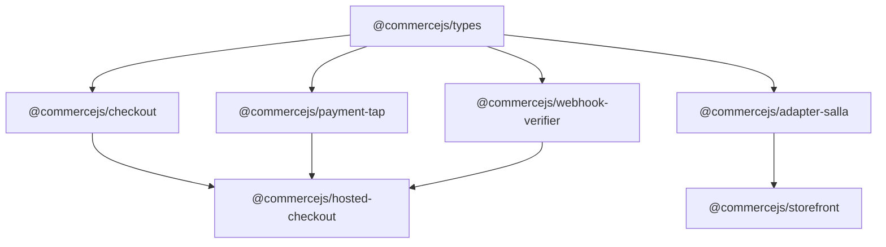

# Overview

> How the CommerceJS packages fit together — the adapter pattern, dependency graph, and design principles.

CommerceJS is organized as a layered architecture where each package has a single responsibility. The packages compose together through well-defined interfaces.

## Package Dependency Graph



All packages depend on `@commercejs/types` as the shared language. The checkout engine depends on the type system and accepts any `PaymentProvider`. The hosted checkout application ties everything together.

## Design Principles

### Adapter Pattern

The `CommerceAdapter` interface defines how storefronts talk to eCommerce backends. Each platform (Salla, Shopify, WooCommerce) provides an adapter that maps its API to the unified types.

```ts
// The adapter contract
interface CommerceAdapter {
  catalog: CatalogAdapter    // Products, categories, brands
  cart: CartAdapter           // Cart operations
  checkout: CheckoutAdapter   // Checkout flow
  customer: CustomerAdapter   // Customer management
  order: OrderAdapter         // Order history, status
  // ... more domains
}
```

A storefront imports the adapter for its platform and calls the same API regardless of the backend:

```ts [storefront/server/api/products.ts]
import { createSallaAdapter } from '@commercejs/adapter-salla'

const adapter = createSallaAdapter({ token, baseUrl })
const products = await adapter.catalog.getProducts({ limit: 10 })
// Returns Product[] — same shape for Salla, Shopify, or any other platform
```

### Provider Interface

Payment providers implement the `PaymentProvider` interface. The checkout engine does not know or care which provider it uses:

```ts
interface PaymentProvider {
  createSession(input: CreatePaymentSessionInput): Promise<PaymentSession>
  confirmSession(sessionId: string): Promise<PaymentSession>
  refund(input: RefundInput): Promise<PaymentSession>
  verifyWebhook(event: PaymentWebhookEvent): Promise<boolean>
}
```

Swapping from Tap to Stripe requires changing one line — the provider instantiation.

### State Machine

The `CheckoutSession` uses a finite state machine to enforce valid checkout flows. Each state has defined transitions, and invalid transitions throw errors:

<table>
<thead>
  <tr>
    <th>
      State
    </th>
    
    <th>
      Allowed Transitions
    </th>
    
    <th>
      Triggered By
    </th>
  </tr>
</thead>

<tbody>
  <tr>
    <td>
      <code>
        idle
      </code>
    </td>
    
    <td>
      <code>
        info
      </code>
    </td>
    
    <td>
      <code>
        setCustomerInfo()
      </code>
    </td>
  </tr>
  
  <tr>
    <td>
      <code>
        info
      </code>
    </td>
    
    <td>
      <code>
        shipping
      </code>
    </td>
    
    <td>
      <code>
        setShippingAddress()
      </code>
    </td>
  </tr>
  
  <tr>
    <td>
      <code>
        shipping
      </code>
    </td>
    
    <td>
      <code>
        payment
      </code>
    </td>
    
    <td>
      <code>
        submitPayment()
      </code>
    </td>
  </tr>
  
  <tr>
    <td>
      <code>
        payment
      </code>
    </td>
    
    <td>
      <code>
        confirming
      </code>
      
      , <code>
        complete
      </code>
      
      , <code>
        failed
      </code>
    </td>
    
    <td>
      <code>
        confirmPayment()
      </code>
      
      , webhook
    </td>
  </tr>
  
  <tr>
    <td>
      <code>
        confirming
      </code>
    </td>
    
    <td>
      <code>
        complete
      </code>
      
      , <code>
        failed
      </code>
    </td>
    
    <td>
      Provider response
    </td>
  </tr>
  
  <tr>
    <td>
      <code>
        failed
      </code>
    </td>
    
    <td>
      <code>
        payment
      </code>
    </td>
    
    <td>
      Retry
    </td>
  </tr>
  
  <tr>
    <td>
      <code>
        complete
      </code>
    </td>
    
    <td>
      —
    </td>
    
    <td>
      Terminal
    </td>
  </tr>
</tbody>
</table>

## Layer Responsibilities

<table>
<thead>
  <tr>
    <th>
      Layer
    </th>
    
    <th>
      Packages
    </th>
    
    <th>
      Role
    </th>
  </tr>
</thead>

<tbody>
  <tr>
    <td>
      <strong>
        Types
      </strong>
    </td>
    
    <td>
      <code>
        @commercejs/types
      </code>
    </td>
    
    <td>
      Shared vocabulary — interfaces only, no runtime code
    </td>
  </tr>
  
  <tr>
    <td>
      <strong>
        Engine
      </strong>
    </td>
    
    <td>
      <code>
        @commercejs/checkout
      </code>
    </td>
    
    <td>
      Business logic — state machine, event emitter
    </td>
  </tr>
  
  <tr>
    <td>
      <strong>
        Providers
      </strong>
    </td>
    
    <td>
      <code>
        @commercejs/payment-tap
      </code>
    </td>
    
    <td>
      Gateway integration — API calls, request mapping
    </td>
  </tr>
  
  <tr>
    <td>
      <strong>
        Infrastructure
      </strong>
    </td>
    
    <td>
      <code>
        @commercejs/webhook-verifier
      </code>
    </td>
    
    <td>
      Cross-cutting — security, verification
    </td>
  </tr>
  
  <tr>
    <td>
      <strong>
        Adapters
      </strong>
    </td>
    
    <td>
      <code>
        @commercejs/adapter-salla
      </code>
    </td>
    
    <td>
      Platform glue — maps external APIs to unified types
    </td>
  </tr>
  
  <tr>
    <td>
      <strong>
        Applications
      </strong>
    </td>
    
    <td>
      <code>
        hosted-checkout
      </code>
      
      , <code>
        storefront
      </code>
    </td>
    
    <td>
      End-user apps — Nuxt applications
    </td>
  </tr>
</tbody>
</table>
