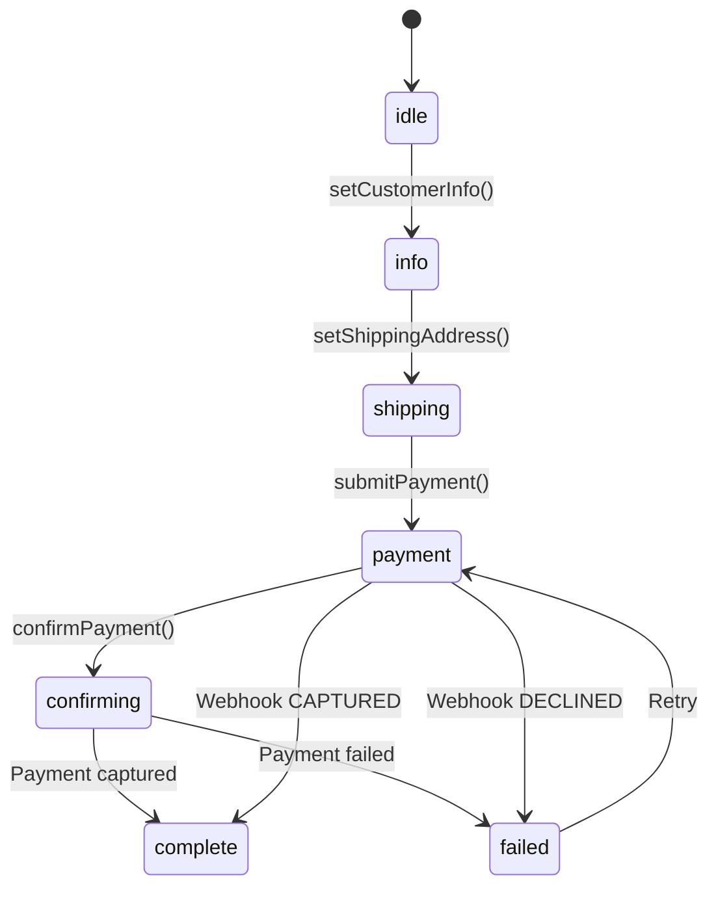

# Quick Start

> Process your first payment with CommerceJS in 5 minutes.

This guide walks through creating a checkout session, submitting a payment, and handling the result. You will use the `CheckoutSession` state machine with the Tap payment provider.

## Create a Checkout Session

The `CheckoutSession` class manages the entire checkout flow. Pass it a payment provider and the order details:

```ts [server/checkout.ts]
import { CheckoutSession } from '@commercejs/checkout'
import { TapPaymentProvider } from '@commercejs/payment-tap'

const provider = new TapPaymentProvider({
  secretKey: process.env.TAP_SECRET_KEY!,
  baseUrl: 'https://api.tap.company/v2',
})

const session = new CheckoutSession({
  provider,
  amount: 99.999,
  currency: 'BHD',
  orderId: 'order-001',
  returnUrl: 'https://myapp.com/checkout/confirm',
})
```

## Set Customer Info

The session follows a state machine. Set customer information to advance from `idle` to `info`:

```ts [server/checkout.ts]
session.setCustomerInfo({
  email: 'customer@example.com',
  firstName: 'Ahmed',
  lastName: 'Al-Rashid',
  phone: '+97312345678',
})
```

## Set Shipping Address

Provide a shipping address to advance to `shipping`:

```ts [server/checkout.ts]
session.setShippingAddress({
  street: '123 Main Street',
  street2: null,
  city: 'Manama',
  state: null,
  country: 'BH',
  postalCode: '1234',
  district: null,
  nationalAddress: null,
})
```

## Submit Payment

Submit a payment with a tokenized card. The provider creates a charge with Tap:

```ts [server/checkout.ts]
const paymentSession = await session.submitPayment({
  sourceToken: 'tok_card_xxxxx', // from goSell.js or Tap's tokenization
})

if (paymentSession.redirectUrl) {
  // Customer needs to complete 3DS verification
  // Redirect them to paymentSession.redirectUrl
}
```

<note>

Most card payments require 3DS authentication. The `redirectUrl` takes the customer to Tap's 3DS page, which redirects back to your `returnUrl` after verification.

</note>

## Confirm Payment

After the customer returns from 3DS, confirm the payment:

```ts [server/confirm.ts]
const chargeId = getQueryParam('tap_id') // from the redirect URL

const confirmed = await session.confirmPayment(chargeId)

if (session.state === 'complete') {
  // Payment captured successfully
  console.log('Order paid!', confirmed)
}
```

## Handle Webhooks

For asynchronous payment results, Tap sends a webhook to your server. The `handleWebhookUpdate` method updates the session state from trusted server-side events:

```ts [server/webhook.ts]
import { WebhookVerifier } from '@commercejs/webhook-verifier'
import { tap as tapConfig } from '@commercejs/webhook-verifier/configs'

const verifier = new WebhookVerifier({
  ...tapConfig,
  secretKey: process.env.TAP_SECRET_KEY!,
})

// Verify the webhook signature
const result = verifier.verify(body, headers)
if (!result.isValid) {
  throw new Error('Invalid webhook signature')
}

// Update the session
session.handleWebhookUpdate({
  id: body.id,
  providerId: 'tap',
  status: body.status === 'CAPTURED' ? 'captured' : 'failed',
  amount: body.amount,
  currency: body.currency,
  redirectUrl: null,
  createdAt: body.created,
})
```

## State Machine Summary

The checkout session follows this state flow:



<tip>

The `handleWebhookUpdate` method can transition the session to `complete` or `failed` from any non-terminal state. This acts as a safety net for cases where the synchronous confirm flow fails.

</tip>
