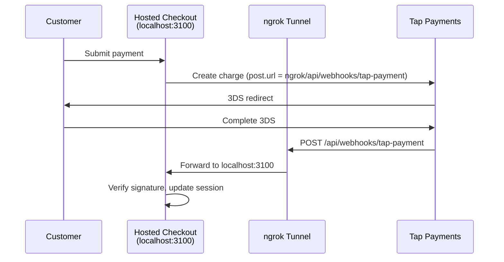

# Webhook Setup

> Set up local webhook testing with ngrok and verify webhook events from payment providers.

Payment providers like Tap send charge results asynchronously via webhooks. During local development, you need a public URL that tunnels to your local server. This guide walks through the complete setup with ngrok.

## Prerequisites

- [ngrok](https://ngrok.com) installed and authenticated
- The hosted checkout running locally on port 3100

## Set Up the Tunnel

<steps>

### Start the hosted checkout

```bash
cd packages/hosted-checkout
pnpm dev
```

### Start ngrok

In a separate terminal, start an ngrok tunnel:

```bash
ngrok http 3100
```

ngrok displays a public URL like `https://abc123.ngrok-free.app`.

### Update APP_URL

Set the `APP_URL` environment variable to the ngrok URL:

```bash [packages/hosted-checkout/.env]
APP_URL="https://abc123.ngrok-free.app"
```

Restart the dev server for the change to take effect.

</steps>

## How Webhooks Flow



## Webhook Handler

The webhook handler at `/api/webhooks/tap-payment` does three things:

1. **Reads** the raw request body
2. **Verifies** the webhook signature with `WebhookVerifier`
3. **Updates** the checkout session with `handleWebhookUpdate`

```ts [server/api/webhooks/tap-payment.post.ts]
import { WebhookVerifier } from '@commercejs/webhook-verifier'
import { tap as tapConfig } from '@commercejs/webhook-verifier/configs'

const verifier = new WebhookVerifier({
  ...tapConfig,
  secretKey: process.env.TAP_SECRET_KEY!,
})

export default defineEventHandler(async (event) => {
  const body = await readBody(event)
  const headers = getHeaders(event)

  // 1. Verify signature
  const result = verifier.verify(body, headers)
  if (!result.isValid) {
    throw createError({ statusCode: 401, message: 'Invalid signature' })
  }

  // 2. Find the checkout session
  const sessionId = body.reference?.order
  const session = getSession(sessionId)

  // 3. Update session state
  session.handleWebhookUpdate({
    id: body.id,
    providerId: 'tap',
    status: body.status === 'CAPTURED' ? 'captured' : 'failed',
    amount: body.amount,
    currency: body.currency,
    redirectUrl: null,
    createdAt: body.created,
  })

  return { received: true }
})
```

## Vite Host Configuration

Vite blocks requests from unknown hosts by default. For ngrok to work, allow all hosts in development:

```ts [nuxt.config.ts]
export default defineNuxtConfig({
  vite: {
    server: {
      allowedHosts: true, // Allow ngrok and other tunnel services
    },
  },
})
```

<warning>

Only use `allowedHosts: true` in development. Production deployments should restrict allowed hosts.

</warning>

## Debugging Webhooks

### Inspect with ngrok

The ngrok dashboard at `http://localhost:4040` shows all incoming requests. Use it to inspect webhook payloads, headers, and response status codes.

### Common Issues

<table>
<thead>
  <tr>
    <th>
      Problem
    </th>
    
    <th>
      Cause
    </th>
    
    <th>
      Fix
    </th>
  </tr>
</thead>

<tbody>
  <tr>
    <td>
      403 from Vite
    </td>
    
    <td>
      Host not allowed
    </td>
    
    <td>
      Set <code>
        allowedHosts: true
      </code>
    </td>
  </tr>
  
  <tr>
    <td>
      401 from handler
    </td>
    
    <td>
      Signature mismatch
    </td>
    
    <td>
      Check <code>
        TAP_SECRET_KEY
      </code>
      
       matches
    </td>
  </tr>
  
  <tr>
    <td>
      No webhook received
    </td>
    
    <td>
      Wrong <code>
        post.url
      </code>
    </td>
    
    <td>
      Verify <code>
        APP_URL
      </code>
      
       is the ngrok URL
    </td>
  </tr>
  
  <tr>
    <td>
      Session not found
    </td>
    
    <td>
      Server restarted
    </td>
    
    <td>
      Sessions are in-memory — restart loses them
    </td>
  </tr>
</tbody>
</table>

## Testing Tip

After a webhook lands, check the ngrok inspector to see the full payload and your server's response. The `hashstring` header contains the signature Tap generated — you can manually verify it against your `TAP_SECRET_KEY` for debugging.
