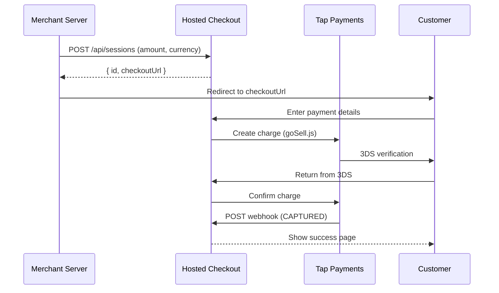

# @commercejs/hosted-checkout

> A ready-to-deploy Nuxt application for hosted checkout with goSell.js integration.

The `@commercejs/hosted-checkout` package is a full Nuxt application that provides a drop-in hosted checkout page. Merchants create a session via API, redirect customers to the checkout URL, and receive webhook notifications when payment completes.

## How It Works



## Running Locally

```bash
cd packages/hosted-checkout
cp .env.example .env  # Configure your Tap keys
pnpm dev
```

The checkout page is available at `http://localhost:3100`.

## Environment Variables

```bash [.env]
TAP_SECRET_KEY="sk_test_xxx"
TAP_PUBLIC_KEY="pk_test_xxx"
TAP_BASE_URL="https://api.tap.company/v2"
TAP_MERCHANT_ID="1632424"
APP_URL="http://localhost:3100"
```

<table>
<thead>
  <tr>
    <th>
      Variable
    </th>
    
    <th>
      Description
    </th>
  </tr>
</thead>

<tbody>
  <tr>
    <td>
      <code>
        TAP_SECRET_KEY
      </code>
    </td>
    
    <td>
      Tap secret key for server-side operations
    </td>
  </tr>
  
  <tr>
    <td>
      <code>
        TAP_PUBLIC_KEY
      </code>
    </td>
    
    <td>
      Tap public key for goSell.js tokenization
    </td>
  </tr>
  
  <tr>
    <td>
      <code>
        TAP_BASE_URL
      </code>
    </td>
    
    <td>
      Tap API base URL
    </td>
  </tr>
  
  <tr>
    <td>
      <code>
        TAP_MERCHANT_ID
      </code>
    </td>
    
    <td>
      Tap merchant ID
    </td>
  </tr>
  
  <tr>
    <td>
      <code>
        APP_URL
      </code>
    </td>
    
    <td>
      Base URL for redirects and webhooks
    </td>
  </tr>
</tbody>
</table>

## API Endpoints

### POST /api/sessions

Create a new checkout session:

```ts
const response = await fetch('https://checkout.myapp.com/api/sessions', {
  method: 'POST',
  body: JSON.stringify({
    amount: 99.999,
    currency: 'BHD',
    orderId: 'order-001',
  }),
})

const { id, checkoutUrl } = await response.json()
// Redirect customer to checkoutUrl
```

### GET /api/sessions/:id

Get the current session state:

```ts
const session = await fetch(`/api/sessions/${sessionId}`)
// Returns CheckoutSnapshot
```

### POST /api/sessions/:id/pay

Submit payment with a tokenized card:

```ts
const result = await fetch(`/api/sessions/${sessionId}/pay`, {
  method: 'POST',
  body: JSON.stringify({
    sourceToken: 'tok_xxx',
    customerInfo: { email, firstName, lastName, phone },
    shippingAddress: { street, city, country },
  }),
})
```

### POST /api/sessions/:id/confirm

Confirm payment after 3DS redirect:

```ts
const result = await fetch(`/api/sessions/${sessionId}/confirm`, {
  method: 'POST',
  body: JSON.stringify({ chargeId: 'chg_xxx' }),
})
```

### POST /api/webhooks/tap-payment

Receives async charge results from Tap. Verifies the webhook signature and updates the session state.

## goSell.js Integration

The checkout page uses Tap's [goSell.js](https://github.com/nicpay-payments/goSellSDK-v2) for PCI-compliant card tokenization. The card element renders inside the checkout page, and tokenization happens on Tap's servers.

```vue [app/pages/[id]/index.vue]
<script setup>
// goSell.js configuration
const config = {
  gateway: {
    publicKey: tapPublicKey,
    language: 'en',
    supportedCurrencies: ['BHD'],
    supportedPaymentMethods: 'all',
  },
  // Card element renders in #card-element
}
</script>
```

## Multi-Merchant Support

The hosted checkout supports multi-merchant scenarios through a merchant configuration store. Each merchant registers their Tap credentials, and the checkout resolves the correct keys at runtime.

<read-more to="/guides/payment-integration">

See the Payment Integration guide for details on adding new payment providers.

</read-more>
